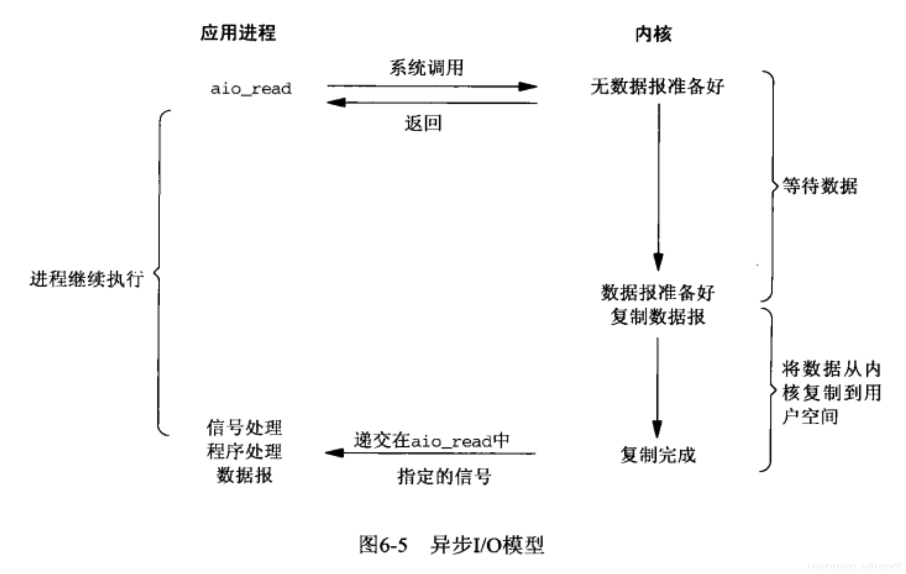

# 系统的IO模型回顾

## 基本概念

### I/O是什么

维基百科上的描述为： I(input)/O(
output)[the collection of interfaces that different functional units of an information processing system use to communicate with each other](https://wiki.yitu-inc.com/pages/viewpage.action?pageId=543953281)  
简单来说就是对中间介质做输入和输出的操作，这里的介质包括但不限制于：键盘，鼠标，系统文件，网卡等

## 系统层面几类IO

### 阻塞IO

  
上图我们可以简单的理解为系统上跑着一个java进程，该进程开了一个socket连接，但然后客户端连接上后，该进程调用read进行数据读取（调用native的read0方法），底层jdk源码调用系统的recvfrom的方法  
为了方便理解，可以认为java进行数据的读取即可  
图上这边java的read线程（为了方便理解：后面直接用进程代替，不做线程的细致区分）是出于阻塞的状态，一直等到系统内核数据从网卡去读完毕后，且将数据从内核中复制到用户空间，这两个阶段都是出于阻塞的，最后数据到达用户空间后才对read做出反馈
整个过程中，这个进程就很呆瓜的一直的等着

### 非阻塞IO


非阻塞IO相对于阻塞IO来说，差异点在于内核从网卡读取数据的这段时间内。在内核从网卡读取数据这段时间内，进程每次调用read都是能够得到返回，虽然这个返回是无数据标识，进程还是重新发起read的操作直到内核读完数据，进行数据拷贝操作，这段时间是处于阻塞状态的  
**这边跟了jdk源码没有发现重复的操作，所以应该是底层调用c的时候做了封装，这边统一认为是这个整体即可。**  
所以非阻塞只是相对于前半段的过程而言

### IO多路复用


多路复用的模型相对前两个IO类型来说会复杂一点了，这边引入selector选择器。  
简单的理解就是原来都是自己进行读的操作，现在都依托于selector来进行处理了。
举个例子：大学宿舍6个人，一开始大家不熟悉中午的时候都各自去食堂打包饭回宿舍吃（别杠说为啥要打包哈），后面大家都混熟了觉得大家都跑一趟太累了，于是舍长说我帮大家打包吧。那么其他的5个人就可以在宿舍打游戏，跟女朋友聊天等。
这边我们亲爱的舍长就是selector，内核读取网卡数据可以理解成去食堂的路程。各自recvfrom的可以理解成打包到宿舍了，大家各吃各的。后面发现好像舍长太优秀了，不止帮忙打包还帮忙洗内裤，收衣服（write以及accept等）
[想要了解怎么说服舍长的过程，点这里](2.回顾JavaIO类型.md "理解JDK NIO的流程")  
想要细致的了解selector的原理可以参考这篇[博客](https://www.cnblogs.com/jpfss/p/10207026.html)

### 信号驱动IO


为了凑数，没啥了解。  
个人理解就是进程发起一个sigaction的调用，然后进程就能获取到一个信号器，当内核从网卡中读取完数据进缓冲池后，就发一个信号给信号器。这时候信号器就会滴滴滴的响，提示进程该去吊起recvfrom方法去做数据的读取了（当然这边也有可能是回调处理等）

### 异步IO


为了凑数，没啥了解。  
个人理解就是进程发起一个aio_read的操作，然后把数据池子给到内核，当数据完成拷贝后通知进程数据已经ok了  
这边跟信号驱动IO的区别是，信号io还是需要起io去进行读的操作，而异步io是完成读的操作后通知进程，第二阶段是异步io是没有阻塞的

### 小结

前面简单通俗的介绍了5中IO，明显能看出其中阻塞和非阻塞都是相对于某个阶段来说的，同步和异步也是如此。  
但是不妨碍我们理解阻塞/非阻塞、异步/同步的理解  
- 阻塞/非阻塞：单个线程遇到同步等待的情况下是否**原地等待**。（如：阻塞IO和非阻塞IO第一阶段的区别）
- 同步/异步：区别在于同步是把事情都做好了才给结果，异步是做好了给你说下你就别管我什么时候做这个事。（如：aio_read和recvfrom方法的区别）  

两类词组两两组合后应该得出：  
- 同步阻塞  
  ```java
  int i = System.in.read();
  ```
- 异步阻塞:
- 同步非阻塞
  ```java
  concurrentLinkedQueue.offer((T) t);
  ```
- 异步非阻塞
  ```java
  Future<T> future = threadPool.submit(Callable<T> callable);
  // doSomething
  future.get();
  ```

## 友情链接

个人博客，一些个人的分享会首发在这里，希望大家有时间可以逛逛  
[young‘s Blog](https://youngjw.com)

## 免责申明
本人非系统层面的研发,文章是本人尽可能总结我所知的内容以及参考一些资料所得。  
内容偏向于中间应用层的知识,有任何问题的话请指正我.感谢！  
涉及相关代码请勿用于生产，出了事故概不负责哈~
## 参考
[selector底层实现](https://www.cnblogs.com/jpfss/p/10207026.html)  
[代码示例](https://cloud.tencent.com/developer/article/1525359)