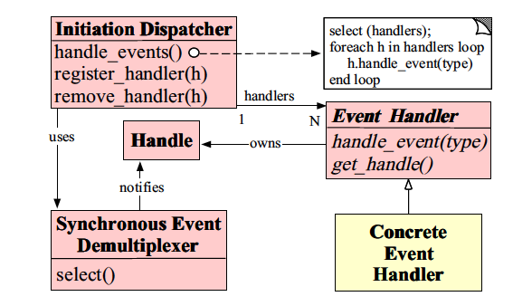

# Java IO类型回顾

## JAVA层面几类IO

### BIO(synchronously blocked IO)

同步阻塞IO：传统IO模型，线程发起IO请求后会一直阻塞等待，知道缓冲区数据就绪可读。例如远古时期网络编程的时候一个线程对应一个socket，特点是简单暴力，缺点是消耗资源
高并发的情况下系统资源很快就会耗尽。对应的就是上个章节的阻塞IO模型

### NIO(synchronous non-blocking IO)
同步非阻塞IO：我们的主角，是同步非阻塞模型，对应上个章节的非阻塞IO模型。  
当线程发起IO的时候，立即返回结果这里就体现了非阻塞的特性（对应非阻塞IO模型的第一个阶段），这里可以做一些其他的操作，不需要跟图中的一样一直去轮询，但是需要保持轮询。    
然后等用户空间的数据就绪了，发起read的操作这里需要同步等待数据的读出，这里体现了同步的特性。*但是java中NIO指的其实的New IO，因为在原来的非阻塞模型中加上了
多路复用的selector模型，所有的轮询都交由selector模型*,当然最后提托的是系统级别的epoll模型来做轮询操作，减轻了线程的轮询压力，业务层只需要专注业务即可。
然后selector将获取的事件通知到对应的线程（这里说线程其实不够准确，应该说channel，后面会深入说明）

### AIO(asynchronous non-blocking IO)

异步非阻塞IO：对应异步IO模型，这是毫无疑问的。异步非阻塞IO描述的是发起IO操作并且带上一个回调的处理然后立即返回结果，当数据就绪的时候会回调我们传入的处理进行调用处理。
jdk这边提供对应的AsynchronousServerSocketChannel等api，但是本人并没有使用过，后续有机会写个demo。  
根据AIO的特性，其实我第一反应其实是callback的接口，大家是否跟我一样。

## Reactor

### 为啥要介绍Reactor

因为Java NIO是基于Reacotr模式开发的，所以有必要先了解下

### 介绍

Reactor是Jim Coplien and Douglas C. Schmidt提出的一种基于事件驱动的一种模式。 其中包含了5中组件：

- Handle(句柄或描述符):代表系统资源，入：socket句柄等，Handle是事件产生的发源地
- Synchronous Event Demultiplexer(同步事件分离器):
  Reactor的核心，等待handles的事件发生，没有出现一直阻塞。如：Linux的select，epoll和java中selector的select方法等
- Event Handler(事件处理器): 事件处理接口，拥有一个回调方法
- Concrete Event Handler(具体事件处理器)：具体事件处理程序，实现了Event Handler接口
- Initiation Dispatcher(初始分发器)：调度程序，它定义了注册、删除和分派事件处理程序的接口。I/O多路复用器负责等待新事件的发生，当它检测到新的事件时，会通知调度程序回调应用程序特定的事件处理程序。  
  整体结构图为：
    
  上面的事件基本为：
- ACCEPT_EVENT：连接请求
- READ_EVENT：表示收到数据
- WRITE_EVENT：表示socket可以足够的缓冲区，可以向其写入数据
- TIMEOUT_EVENT：超时。Java NIO不支持这个事件
- SIGNAL_EVENT：信号。Java NIO不支持这个事件
- CLOSE_EVENT：该socket被关闭。Java NIO不支持这个事件

### 线程模型

Reactor可以细分为

- 单Reactor单线程模型
- 单Reactor多线程模型
- 主从Reactor多线程模型 这边不做过多的说明，可以参考大佬-Doug Lea[资料](./sources/nio.pdf)

## 友情链接

个人博客，一些个人的分享会首发在这里，希望大家有时间可以逛逛  
[young‘s Blog](https://youngjw.com/)

## 免责申明

本人非系统层面的研发,文章是本人尽可能总结我所知的内容以及参考一些资料所得。  
内容偏向于中间应用层的知识,有任何问题的话请指正我.感谢！  
涉及相关代码请勿用于生产，出了事故概不负责哈~

## 参考

[The difference between BIO and NIO, AIO](https://www.programmersought.com/article/10551850908/)
[An Object Behavioral Pattern for Demultiplexing and Dispatching Handles for Synchronous Events](http://www.yeolar.com/note/2012/12/09/reactor/)
[Reactor模式中的5种组件](https://blog.csdn.net/eric520zenobia/article/details/100785412)
[reactor模式与java nio](https://blog.csdn.net/zhengleiguo/article/details/30829583)
