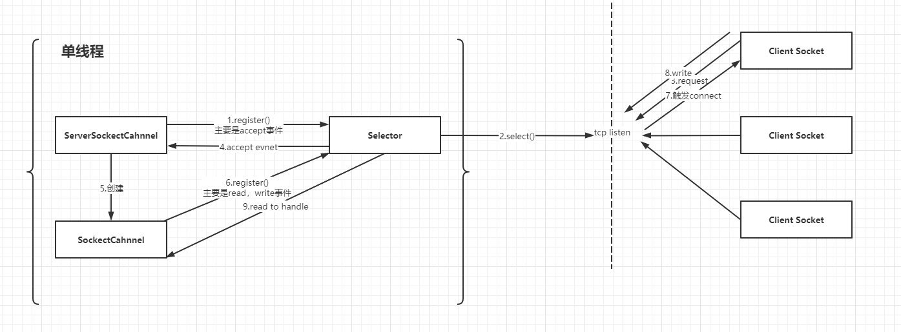

# JAVA NIO的理解

## 前言

这面两篇已经大致的回顾了一些概念性的知识  
也是时候细聊下java nio了  
程序员嘛不多BB，一边看代码一边聊吧

## 源码示例

[前面一篇](2.回顾JavaIO类型.md)已经提到了Reactor的多种线程模型，并且Java NIO是基于Reactor模式开发的，那我们来逐个看下三个模型对应的代码以及 简单聊下区别点
其中[客户端代码](src/main/java/com/sourcecode/learning/young/jdknio/NioClient.java)都是统一的，就不贴出来了，主要是服务端的区别

### 单Reactor单线程

<details>
    <summary>查看代码</summary>

    public class NioServer {
        private Selector selector;
        private ByteBuffer readBuffer = ByteBuffer.allocate(1024);//调整缓存的大小可以看到打印输出的变化
        private ByteBuffer sendBuffer = ByteBuffer.allocate(1024);//调整缓存的大小可以看到打印输出的变化
    
        String str;
    
        public void start() throws IOException {
            // 打开服务器套接字通道
            ServerSocketChannel ssc = ServerSocketChannel.open();
            // 服务器配置为非阻塞
            ssc.configureBlocking(false);
    
            // 进行服务的绑定
            ssc.bind(new InetSocketAddress("localhost", 8001));
    
            // 通过open()方法找到Selector
            selector = Selector.open();
            // 注册到selector，等待连接
            ssc.register(selector, SelectionKey.OP_ACCEPT);
    
            while (!Thread.currentThread().isInterrupted()) {
                selector.select();
                Set<SelectionKey> keys = selector.selectedKeys();
                Iterator<SelectionKey> keyIterator = keys.iterator();
                while (keyIterator.hasNext()) {
                    SelectionKey key = keyIterator.next();
                    if (!key.isValid()) {
                        continue;
                    }
                    if (key.isAcceptable()) {
                        accept(key);
                    } else if (key.isReadable()) {
                        read(key);
                    } else if (key.isWritable()) {
                        write(key);
                    }
                    keyIterator.remove(); //该事件已经处理，可以丢弃
                }
            }
        }
    
        private void write(SelectionKey key) throws IOException, ClosedChannelException {
            SocketChannel channel = (SocketChannel) key.channel();
            System.out.println("write back to client message:" + str);
            sendBuffer.clear();
            sendBuffer.put(str.getBytes());
            sendBuffer.flip();
            channel.write(sendBuffer);
            channel.register(selector, SelectionKey.OP_READ);
        }
    
        private void read(SelectionKey key) throws IOException {
            SocketChannel socketChannel = (SocketChannel) key.channel();
            this.readBuffer.clear();
            int numRead;
            try {
                numRead = socketChannel.read(this.readBuffer);
            } catch (IOException e) {
                key.cancel();
                socketChannel.close();
                return;
            }
    
            str = new String(readBuffer.array(), 0, numRead);
            System.out.println("accept " + socketChannel.getRemoteAddress().toString() + " client message:" + str);
            socketChannel.register(selector, SelectionKey.OP_WRITE);
        }
    
        private void accept(SelectionKey key) throws IOException {
            ServerSocketChannel ssc = (ServerSocketChannel) key.channel();
            SocketChannel clientChannel = ssc.accept();
            clientChannel.configureBlocking(false);
            clientChannel.register(selector, SelectionKey.OP_READ);
            System.out.println("a new client connected " + clientChannel.getRemoteAddress());
        }
    
        public static void main(String[] args) throws IOException {
            new NioServer().start();
        }
    }

</details>
单线程的模型就是ServerSocketChannel端口链接监听以及读写事件和业务处理都在一个线程中。

### 单Reactor多线程

<details>
    <summary>查看代码</summary>
    
    public class NioMultiThreadServer {

        private static Selector selector = null;
        private static Queue<Task> taskQueen = new ConcurrentLinkedQueue<>();
    
        public static void addQueen(Task key) {
            taskQueen.add(key);
            selector.wakeup();
        }
    
        public void start() throws IOException {
            ServerSocketChannel ssc = ServerSocketChannel.open();
            ssc.configureBlocking(false);
            ssc.bind(new InetSocketAddress("localhost", 9041));
            selector = Selector.open();
            ssc.register(selector, SelectionKey.OP_ACCEPT);
    
            while (!Thread.currentThread().isInterrupted()) {
                int num = selector.select();
                if (num > 0) {
                    Set<SelectionKey> keys = selector.selectedKeys();
                    Iterator<SelectionKey> keyIterator = keys.iterator();
                    while (keyIterator.hasNext()) {
                        SelectionKey key = keyIterator.next();
                        keyIterator.remove();
                        if (!key.isValid()) {
                            continue;
                        }
                        if (key.isAcceptable()) {
                            accept(key);
                        } else if (key.isReadable()) {
                            key.cancel();
                            Processor.read(key);
                        } else if (key.isWritable()) {
                            key.cancel();
                            Processor.write(key);
                        }
                    }
                } else {
                    Task task;
                    while ((task = taskQueen.poll()) != null) {
                        SelectionKey key = task.getKey();
                        //注册写事件
                        SocketChannel channel = (SocketChannel) key.channel();
                        Object attachment = key.attachment();
                        channel.register(selector, task.operator, attachment);
                    }
                }
            }
        }
    
        private void accept(SelectionKey key) throws IOException {
            ServerSocketChannel ssc = (ServerSocketChannel) key.channel();
            SocketChannel clientChannel = ssc.accept();
            clientChannel.configureBlocking(false);
            clientChannel.register(selector, SelectionKey.OP_READ);
            System.out.println("a new client connected " + clientChannel.getRemoteAddress());
        }
    
        public static class Task {
            private SelectionKey key;
            private int operator;
    
            public Task(SelectionKey key, int operator) {
                this.key = key;
                this.operator = operator;
            }
    
            public int getOperator() {
                return operator;
            }
    
            public SelectionKey getKey() {
                return key;
            }
        }
    
        public static class Processor {
            //构造线程池
            private static ExecutorService executorService = Executors.newFixedThreadPool(10);
    
            public static void write(final SelectionKey key) {
                //拿到线程并执行
                executorService.submit(() -> {
                    try {
                        // 写操作
                        SocketChannel writeChannel = (SocketChannel) key.channel();
                        //拿到客户端传递的数据
                        String message = (String) key.attachment();
                        System.out.println("write back to client message:" + message);
                        ByteBuffer buffer = ByteBuffer.allocate(1024);
                        buffer.put(message.getBytes());
                        buffer.flip();
                        writeChannel.write(buffer);
                        NioMultiThreadServer.addQueen(new Task(key, SelectionKey.OP_READ));
                    } catch (IOException e) {
                        e.printStackTrace();
                    }
                });
            }
    
            public static void read(final SelectionKey key) {
                //获得线程并执行
                executorService.submit(() -> {
                    ByteBuffer readBuffer = ByteBuffer.allocate(1024);
                    SocketChannel readChannel = null;
                    try {
                        readChannel = (SocketChannel) key.channel();
                        readBuffer.clear();
                        int numRead;
                        numRead = readChannel.read(readBuffer);
                        String message = new String(readBuffer.array(), 0, numRead);
                        System.out.println("accept " + readChannel.getRemoteAddress().toString() + " client message:" + message);
                        //将数据添加到key中
                        key.attach(message);
                        //将注册写操作添加到队列中
                        NioMultiThreadServer.addQueen(new Task(key, SelectionKey.OP_WRITE));
                    } /*catch (NotYetConnectedException nce) {
    
                    }*/ catch (IOException e) {
                        // 简单弄，就不分步去固定捕获read的异常了。
                        try {
                            System.out.println(readChannel.getRemoteAddress().toString() + " is disconnected");
                            readChannel.close();
                        } catch (IOException ioe) {
                            ioe.printStackTrace();
                        }
                    }
                });
            }
    
        }
    
        public static void main(String[] args) throws IOException {
            new NioMultiThreadServer().start();
        }
    }

</details>  

多线程的这种模式好处在于，端口链接事件交由主线程处理，而读和写和业务处理等事件交由线程池处理，各司其职，极大的提高了效率  

在多线程处理的时候需要注意几个地方:  
1.一开始改写单线程的时候就是直接把处理扔到ExecutorService里面去跑，结果发现读取数据的时候会多次（错误示例代码详见:[demo_error](src/main/java/com/sourcecode/learning/young/jdknio/multithread/NioMultiThreadServer_Error_1.java)
） 后面才排查到因为子线程没有执行完，而channel还一直存在导致主线程一直认为read事件没结束，所以还能获取到对应的事件导致一直触发新的子线程去处理。  
所以需要取消主线程对channel的监控,在处理吊起子线程处理read的时候先调用下cancel方法。

```java
    key.cancel();
```

2.根据1的修改发现读正常了，但是没法写了。（错误示例代码详见:[demo_error](src/main/java/com/sourcecode/learning/young/jdknio/multithread/NioMultiThreadServer_Error_2.java)
） 没排查到问题，只能google下。后面有位老哥（[飞机票](#问题排查 "引用")）说是因为selector.select()
和注册操作需要同步的。也就是说之前主线程取消了对channel的监控在子线程中对该channel注册了写操作是不work的 好吧，那就将注册操作都统一放到主线程中。最后的结果就是上面的示例了

### 多Reactor多线程

<details>
    <summary>查看代码</summary>

    public class NioMultiReactorServer {

        public static void main(String[] args) throws IOException {
            new MainReactor().start();
        }
    
        static class MainReactor {
            private static int subSize = 5;
            private static ExecutorService subPool = Executors.newFixedThreadPool(subSize);
            private static SubReactor[] subReactors = new SubReactor[subSize];
            private static Selector selector = null;
    
            public MainReactor() throws IOException {
                ServerSocketChannel ssc = ServerSocketChannel.open();
                ssc.configureBlocking(false);
                ssc.bind(new InetSocketAddress("localhost", 9041));
                selector = Selector.open();
                ssc.register(selector, SelectionKey.OP_ACCEPT);
            }
    
            public void start() throws IOException {
                for (int i = 0; i < subSize; i++) {
                    SubReactor subReactor = new SubReactor();
                    subReactors[i] = subReactor;
                    subPool.execute(subReactor);
                }
                while (!Thread.currentThread().isInterrupted()) {
                    try {
                        selector.select();
                        Set<SelectionKey> keys = selector.selectedKeys();
                        Iterator<SelectionKey> keyIterator = keys.iterator();
                        while (keyIterator.hasNext()) {
                            SelectionKey selectionKey = keyIterator.next();
                            if (selectionKey.isAcceptable()) {
                                accept(selectionKey);
                            }
                        }
                    } catch (Exception e) {
                        e.printStackTrace();
                    }
                }
            }
    
            private void accept(SelectionKey key) throws IOException {
                ServerSocketChannel ssc = (ServerSocketChannel) key.channel();
                SocketChannel clientChannel = ssc.accept();
                subReactors[new Random().nextInt(subSize)].accpetChannel(clientChannel);
            }
        }
    
        static class SubReactor implements Runnable {
    
            private static int workSize = 10;
    
            private Selector selector;
            private ExecutorService workPool = Executors.newFixedThreadPool(workSize);
            /**
             * 基于链接节点的、无界的、线程安全 不允许为null
             */
            private Queue<Object> dataQueue = new ConcurrentLinkedQueue();
    
            public SubReactor() throws IOException {
                selector = Selector.open();
            }
    
            @Override
            public void run() {
                while (!Thread.currentThread().isInterrupted()) {
                    int num;
                    try {
                        num = selector.select();
                    } catch (IOException e) {
                        System.err.println("select error ,thread run over");
                        return;
                    }
                    if (num > 0) {
                        Set<SelectionKey> keys = selector.selectedKeys();
                        Iterator<SelectionKey> keyIterator = keys.iterator();
                        while (keyIterator.hasNext()) {
                            SelectionKey key = keyIterator.next();
                            keyIterator.remove();
                            if (!key.isValid()) {
                                continue;
                            }
                            if (key.isReadable()) {
                                key.cancel();
                                workPool.execute(() -> {
                                    SocketChannel readChannel = null;
                                    ByteBuffer readBuffer = ByteBuffer.allocate(1024);
                                    try {
                                        readChannel = (SocketChannel) key.channel();
                                        int numRead;
                                        numRead = readChannel.read(readBuffer);
                                        String message = new String(readBuffer.array(), 0, numRead);
                                        System.out.println("accept " + readChannel.getRemoteAddress().toString() + " client message:" + message);
                                        //将数据添加到key中
                                        key.attach(message);
                                        //将注册写操作添加到队列中
                                        dataQueue.add(new Task(key, SelectionKey.OP_WRITE));
                                        selector.wakeup();
                                    } catch (IOException e) {
                                        // 简单弄，就不分步去固定捕获read的异常了。
                                        try {
                                            System.out.println(readChannel.getRemoteAddress().toString() + " is disconnected");
                                            readChannel.close();
                                        } catch (IOException ioe) {
                                            ioe.printStackTrace();
                                        }
                                    }
                                });
                            } else if (key.isWritable()) {
                                key.cancel();
                                workPool.execute(() -> {
                                    try {
                                        SocketChannel writeChannel = (SocketChannel) key.channel();
                                        String message = (String) key.attachment();
                                        System.out.println("write back to client message:" + message);
                                        ByteBuffer buffer = ByteBuffer.allocate(1024);
                                        buffer.put(message.getBytes());
                                        buffer.flip();
                                        writeChannel.write(buffer);
                                        dataQueue.add(new Task(key, SelectionKey.OP_READ));
                                        selector.wakeup();
                                    } catch (IOException e) {
                                        e.printStackTrace();
                                    }
                                });
                            }
                        }
                    } else {
                        Object obj;
                        while ((obj = dataQueue.poll()) != null) {
                            if (obj instanceof SocketChannel) {
                                registerChannel((SocketChannel) obj);
                            } else if (obj instanceof Task) {
                                processEvent((Task) obj);
                            } else {
                                throw new RuntimeException("not match queue data");
                            }
                        }
                    }
                }
            }
    
            private void registerChannel(SocketChannel socketChannel) {
                try {
                    socketChannel.configureBlocking(false);
                    socketChannel.register(selector, SelectionKey.OP_READ);
                    System.out.println("a new client connected " + socketChannel.getRemoteAddress());
                } catch (IOException e) {
                    e.printStackTrace();
                }
            }
    
            private void processEvent(Task task) {
                SelectionKey key = task.getKey();
                //注册写事件
                SocketChannel channel = (SocketChannel) key.channel();
                Object attachment = key.attachment();
                try {
                    channel.register(selector, task.getOperator(), attachment);
                } catch (ClosedChannelException e) {
                    try {
                        System.err.println(channel.getRemoteAddress() + " register to selector fail");
                        key.channel();
                        channel.close();
                    } catch (IOException ioException) {
                        ioException.printStackTrace();
                    }
                }
            }
    
    
            public void accpetChannel(SocketChannel socketChannel) throws IOException {
                if (Objects.isNull(socketChannel)) {
                    throw new IllegalArgumentException("socket channel can not be null");
                }
                dataQueue.add(socketChannel);
                System.out.println("add accpet channel to queue");
                selector.wakeup();
            }
    
        }
    }

</details>

## 理解JDK NIO的流程


以图中的单Reactor单线程为例以及配合上面的代码简单说下整体的流程：  
1.将ServerSocketChannel初始化后的对象注册到Selector选择器上，并且这边只注册了ACCEPT事件  
2.然后无限while循环Selector的select方法，线程就会随着select的调用而阻塞等待事件的触发响应  
3.这时候我们将Client吊起连接服务端，触发了监听的ACCEPT事件  
4.阻塞等待等到了结果返回结果
5.通过ServerSocketChannel的accept()方法得到专门用户与这个Client交互的SocketChannel对象  
6.SocketChannel对象配置非阻塞后注册到Selector上，且事件只需要Read就好  
7.Client确认链接上了  
8.Client开始写入数据内容  
9.SocketChannel对象获取到监听的Read事件，然后读出内容。将注册的事件改成Write事件

后面两种线程模型的图就不画了，先欠着~

## 小结  
这里只是简单的介绍了下整体的流程和代码样例。其实里面很多的内容是可以探讨的例如：SelectionKey和Channel的关系，OP_WRITE的触发条件，取消注册的Channel,wakeup的原理等  
有兴趣的看官可以找些资料了解下，因为篇幅的问题就不整理了  
**各位看官可以多关注主从Reactor多线程的模型，因为后续要介绍的Netty就是这种Reactor模式**

## 友情链接

个人博客，一些个人的分享会首发在这里，希望大家有时间可以逛逛  
[young‘s Blog](https://youngjw.com)

## 免责申明

本人非系统层面的研发,文章是本人尽可能总结我所知的内容以及参考一些资料所得。  
内容偏向于中间应用层的知识,有任何问题的话请指正我.感谢！  
涉及相关代码请勿用于生产，出了事故概不负责哈~

## 参考

[问题排查](https://blog.csdn.net/MOTUI/article/details/52792146)