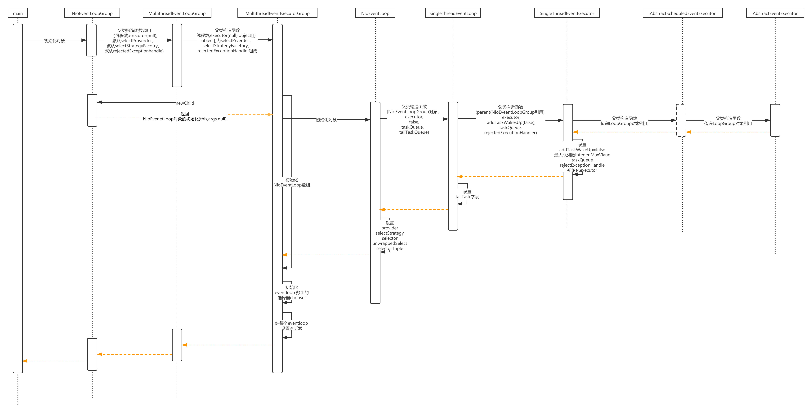

## 走读

为了方便各位看官理解，我这边简单画了NioEventLoopGroup实例初始化的时序图

一般我们在使用Netty的时候，都是初始化两个NioEventLoopGroup的实例，一个是Boss(主要用于处理ACCEPT的链接事件)， 一个是Work(用于处理READ、WORK的事件以及一些业务处理)
契合Reacotr的主从Reactor模式  
我们这边先根据了解下一个NioEventLoopGroup实例包含哪些内容  
初始化NioEventLoopGroup对象的时候，一般都是使用无参构造函数或者是执行线程数的构造函数，若是使用无参构造函数则线程数为

```java
    DEFAULT_EVENT_LOOP_THREADS=Math.max(1,SystemPropertyUtil.getInt(
        "io.netty.eventLoopThreads",NettyRuntime.availableProcessors()*2));
```

如果一系列的环境变量没有配置的话，最后获取到的是Java虚拟机可用处理器数量*2，并且最少保证了必须大于等于1。  
后面不断调用父类的构造函数，到了MultithreadEventExecutorGroup的时候，此时参数为

- int thread:前面说的线程数
- Executor executor: 执行器，此时还是null
- EventExecutorChooserFactory chooserFactory：看着像是事件执行的选择器,用的是默认的

```java
    public static final DefaultEventExecutorChooserFactory INSTANCE=new DefaultEventExecutorChooserFactory();
```

- Object[] args：由SelectorProvider(初始化ServerSocketChannel用到),SelectStrategyFactory(看着像是Select的策略,未知)
  ,RejectedExecutionHandlers(某个东西拒绝策略，未知)构成，都是默认对象且是有序的

```java
  SelectorProvider selectorProvider=SelectorProvider.provider();
        SelectStrategyFactory selectStrategyFactory=new DefaultSelectStrategyFactory();
        RejectedExecutionHandler REJECT=new RejectedExecutionHandler(){
@Override
public void rejected(Runnable task,SingleThreadEventExecutor executor){
        throw new RejectedExecutionException();
        }
        }; 
```

从时序图中可以看到MultithreadEventExecutorGroup是主要初始化战场，其中主要线索就是

- 初始化executor
- 初始化EventExecutor[] children
- 初始化EventExecutorChooserFactory.EventExecutorChooser
- 给children数组配置监听器
- 配置Set<EventExecutor> readonlyChildren

### 初始化executor

```java
    if(executor==null){
        executor=new ThreadPerTaskExecutor(newDefaultThreadFactory());
        }
```

这边newDefaultThreadFactory()方法返回的是DefaultThreadFactory类的对象，默认的一个线程工厂,该类重写newThread方法的时候new 出来的是**FastThreadLocalThread**
对象  
ThreadPerTaskExecutor到时比较纯粹实现了Executor的接口，execute()方法就是刚说的工厂类的newThread方法，然后调用start方法进行线程吊起

### 初始化EventExecutor[] children

children数组长度就是传入的nThreads的值  
然后遍历数组，调用newChild方法对数组进行元素的初始化操作，其中newChild抽象方法是在子类NioEventLoopGroup中重写的。

```java
    new NioEventLoop(this,executor,(SelectorProvider)args[0],
        ((SelectStrategyFactory)args[1]).newSelectStrategy(),(RejectedExecutionHandler)args[2],queueFactory);
```
从构造函数看，说明NioEventLoop持有NioEventLoopGroup的引用，且NioEventLoop是
从时序图来看NioEventLoop的类对象一系列的初始化过程不难发现，NioEventLoop持有的属性有
- 所属NioEventLoopGroup的对象
- tailTask任务队列(**无锁方式的线程安全无边界队列,基于JCTools实现的,后面可以细聊下**)
- addTaskWakesUp=false 猜测下应该是判定是否调用selector.wakeup()的方法
- Executor对象,因为前面已经知道了executor的实现其实是创建一个FastThreadLocalThread对象，在ThreadExecutorMap的apply会记录这个信息(暂时不清楚干啥的)
```java
  this.executor = ThreadExecutorMap.apply(executor, this);

  public static Executor apply(final Executor executor, final EventExecutor eventExecutor) {
      ObjectUtil.checkNotNull(executor, "executor");
      ObjectUtil.checkNotNull(eventExecutor, "eventExecutor");
      return new Executor() {
      @Override
      public void execute(final Runnable command) {
          executor.execute(apply(command, eventExecutor));
         }
      };
  }
```
- taskQueue任务队列(**无锁方式的线程安全无边界队列,基于JCTools实现的,后面可以细聊下**)
- rejectedExecutionHandler 一早初始化的默认拒绝策略
- provider=SelectorProvider 一早默认初始化的
- selectStrategy=SelectStrategy 一早默认初始化的
- Selector selector和 Selector unwrappedSelector 都是通过openSelector方法初始化的  
其中unwrappedSelector就是很朴素的通过SelectorProvider初始化的，原生的Java NIO的Selector
```java
  unwrappedSelector = provider.openSelector();
```
**而selector是Netty基于原生selector优化的实现SelectedSelectionKeySetSelector，具体优化点可以后面聊聊**

### 初始化EventExecutorChooserFactory.EventExecutorChooser
```java
   chooser = chooserFactory.newChooser(children);

   public EventExecutorChooser newChooser(EventExecutor[] executors) {
      if (isPowerOfTwo(executors.length)) {
         return new PowerOfTwoEventExecutorChooser(executors);
      } else {
          return new GenericEventExecutorChooser(executors);
      }
   }
```
其中isPowerOfTwo判断children数组长度是不是2的指数，选择创建不同的对象，很明显指数的获取方式更快，普通的是取模的方式。  
这两个唯一的不同就是next方法的实现，很明显可以猜到chooser就是从children数组里面选取哪个NioEventLoop对象。


### 给children数组配置监听器
```java
    final FutureListener<Object> terminationListener = new FutureListener<Object>() {
        @Override
        public void operationComplete(Future<Object> future) throws Exception {
            if (terminatedChildren.incrementAndGet() == children.length) {
                terminationFuture.setSuccess(null);
            }
        }
    };
```
这里是为每个NioEventLoop的Promise配置监听器(Promise继承JDK的Future接口)  
那我们很明显能够猜测出NioEventLoop执行Runnable任务的时候，会在NioEventLoopGroup的terminatedChildren计数器上加1。  
且当计数器与children数组相等的时候，terminationFuture回调设置成success的

### 配置Set<EventExecutor> readonlyChildren
```java
   Set<EventExecutor> childrenSet = new LinkedHashSet<EventExecutor>(children.length);
   Collections.addAll(childrenSet, children);
   readonlyChildren = Collections.unmodifiableSet(childrenSet);
```
其实就是将children数组数据导入到Set中，且这个数组的数据是不可修改的

## 小结
通过上面的初始化过程的分析，我们能够得出关键信息：  
每个NioEventLoopGroup持有多个NioEventLoop的对象  
而每个NioEventLoop对象都有一个Selector对象和两个任务队列以及Executor对象，并且每个NioEventLoop本身也是一个Executor  
之前我们回顾Java NIO的时候写了每种Rector的实现代码demo，但是不管哪种实现都必须包含以下几个步骤核心：  
1.创建ServerSocketChannel对象  
2.创建Selector对象  
3.将ServerSocketChannel对象绑定到Selector上并且配置ACCEPT监听事件  
4.通过Selector.select()获取到对应的SocketChannel然后再将SocketChannel绑定到Selector上  
5.获取到SocketChannel的监听事件，然后进行业务的处理  

当前ServerSocketChannel还未创建，然后Boss和Work之间的关联是怎么对接上的，以及事件的监听等皆尚未可知  
请各位看官往下看


## 友情链接

个人博客，一些个人的分享会首发在这里，希望大家有时间可以逛逛  
[young‘s Blog](https://youngjw.com/)

## 免责申明

本人非系统层面的研发,文章是本人尽可能总结我所知的内容以及参考一些资料所得。  
内容偏向于中间应用层的知识,有任何问题的话请指正我.感谢！  
涉及相关代码请勿用于生产，出了事故概不负责哈~