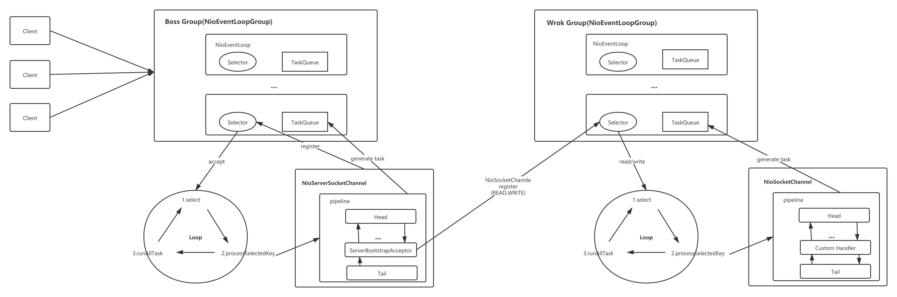

## 走读

看完前面两篇后，我们能够猜测到核心的初始化操作都在bind方法里面实现的，所以老规矩我们先看下时序图，对整个流程有个大致的了解

这次我们可以带着些许遗留的疑问进行走读了，例如：ServerSocketChannel创建和托管，然后Boss和Work之间的关联是怎么对接上的，以及事件的监听等

从时序图中我们很明显看出核心的代码就是AbstractBootstrap的initAndRegister方法，主要分成Channel的创建和初始化操作以及Channel的注册

### Channel创建

上篇我们就有说明了Channle的创建是通过反射工厂通过newInstance来创建对象的  
所以我们直接看NioServerSocketChannel的空参构造方法即可  
```java
    public NioServerSocketChannel() {
        this(newSocket(DEFAULT_SELECTOR_PROVIDER));
    }

    private static ServerSocketChannel newSocket(SelectorProvider provider) {
        try {
            return provider.openServerSocketChannel();
        } catch (IOException e) {
            throw new ChannelException(
                "Failed to open a server socket.", e);
        }
    }
```
在空参的构造方法中直接调用了newSocket方法，**这个方法中我们看到了熟悉的ServerSocketChannel对象的创建**  
#### 父类构造溯源调用
NioServerSocketChannel构造函数中网上溯源调用父类的构造函数，直接到AbstractNioChannel的构造函数且此时传入的参数为:
- Channel parent = null
- SelectableChannel ch = 刚新建的ServerSocketChannel对象，配置成非阻塞
- int readInterestOp = SelectionKey.OP_ACCEPT 

AbstractNioChannel构造函数中除了对传入参数做字段引用之类之外，还会继续调用父类AbstractChannel构造函数
```java
    protected AbstractChannel(Channel parent) {
        this.parent = parent;
        id = newId();
        unsafe = newUnsafe();
        pipeline = newChannelPipeline();
    }
```  
其中id是ChannelId的对象具体实现类是DefaultChannelId，这里面包含了一些machineId，processId，sequence，时间戳等信息。具体干啥的不懂，后面再看  

其中unsafe是Unsafe的对象具体实现类是NioSocketChannelUnsafe，
```java
    private final class NioSocketChannelUnsafe extends NioByteUnsafe {
        @Override
        protected Executor prepareToClose() {
            try {
                if (javaChannel().isOpen() && config().getSoLinger() > 0) {
                    doDeregister();
                    return GlobalEventExecutor.INSTANCE;
                }
            } catch (Throwable ignore) {
            }
            return null;
        }
    }
```
doDeregister回调的是AbstractNioChannel的doDeregister()方法，具体实现应该就是key.cancel()，暂不细究
其中pipeline的创建就是将当前的Channel进行引用，每个Channel都有独立的pipeline，以及创建pipeline的Context对象以及回调future后面再看

#### ServerSocketChannelConfig创建
```java
    config = new NioServerSocketChannelConfig(this, javaChannel().socket());
```
config持有该NioServerSocketChannel的引用，并且为该NioServerSocketChannel对象分配接口数据bytebuf的大小

### Channel初始化
先为NioServerSocketChannel对象配置option以及attributes参数  
获取Channel的Pipeline对象，然后将添加一个ChannelInitializer抽象类的匿名对象，重点是initChannel方法的实现  
在initChannel实现方法中，通过NioServerSocketChannel对象获取该对象所属的NioEventLoop（此时NioServerSocketChannel对象还未注册到具体的NioEventLoop中）
的execute方法将ServerBootstrapAcceptor对象添加进pipeline中。
```java
    p.addLast(new ChannelInitializer<Channel>() {
        @Override
        public void initChannel(final Channel ch) {
            final ChannelPipeline pipeline = ch.pipeline();
            ChannelHandler handler = config.handler();
            if (handler != null) {
                pipeline.addLast(handler);
            }

            ch.eventLoop().execute(new Runnable() {
                @Override
                public void run() {
                    pipeline.addLast(new ServerBootstrapAcceptor(
                            ch, currentChildGroup, currentChildHandler, currentChildOptions, currentChildAttrs));
                }
            });
        }
    });
```
重点看下ServerBootstrapAcceptor类的channelRead的实现
```java
    public void channelRead(ChannelHandlerContext ctx, Object msg) {
        final Channel child = (Channel) msg;
        child.pipeline().addLast(childHandler);
        setChannelOptions(child, childOptions, logger);
        setAttributes(child, childAttrs);
        try {
            childGroup.register(child).addListener(new ChannelFutureListener() {
                @Override
                public void operationComplete(ChannelFuture future) throws Exception {
                    if (!future.isSuccess()) {
                        forceClose(child, future.cause());
                    }
                }
            });
        } catch (Throwable t) {
           forceClose(child, t);
        }
    }
```
**因为ServerSocketChannel只监听ACCEPT事件，所以这边的msg对象本质就是SocketChannel对象，然后将这个对象直接注册到Work Group的某个NioEventLoop的Selector上达成了绑定**

### Channel注册
```java
    ChannelFuture regFuture = config().group().register(channel);
```
这里调用的是前面说过的MultithreadEventLoopGroup的register方法，里面的本上就是调用直接chooser.next()，里面就是在NioEventLoop数组里随机挑选一个对象，后面就是调用该对象的register方法  
```java
    public ChannelFuture register(Channel channel) {
        return register(new DefaultChannelPromise(channel, this));
    }

    public ChannelFuture register(final ChannelPromise promise) {
        ObjectUtil.checkNotNull(promise, "promise");
        promise.channel().unsafe().register(this, promise);
        return promise;
    }
```
这里最后调用的是channel的unsafe对象的register方法，这边的unsafe就是前面channel创建的时候生成的NioSocketChannelUnsafe对象，具体的register实现在父类AbstractUnsafe中
```java
    public final void register(EventLoop eventLoop, final ChannelPromise promise) {
        ObjectUtil.checkNotNull(eventLoop, "eventLoop");
        if (isRegistered()) {
            promise.setFailure(new IllegalStateException("registered to an event loop already"));
            return;
        }
        if (!isCompatible(eventLoop)) {
            promise.setFailure(
                    new IllegalStateException("incompatible event loop type: " + eventLoop.getClass().getName()));
            return;
        }

        AbstractChannel.this.eventLoop = eventLoop;

        if (eventLoop.inEventLoop()) {
            register0(promise);
        } else {
            try {
                eventLoop.execute(new Runnable() {
                    @Override
                    public void run() {
                        register0(promise);
                    }
                });
            } catch (Throwable t) {
                logger.warn(
                        "Force-closing a channel whose registration task was not accepted by an event loop: {}",
                        AbstractChannel.this, t);
                closeForcibly();
                closeFuture.setClosed();
                safeSetFailure(promise, t);
            }
        }
    }
```
重点再看register0的doRegister实现
```java
    protected void doRegister() throws Exception {
        boolean selected = false;
        for (;;) {
            try {
                selectionKey = javaChannel().register(eventLoop().unwrappedSelector(), 0, this);
                return;
            } catch (CancelledKeyException e) {
                if (!selected) {
                    eventLoop().selectNow();
                    selected = true;
                } else {
                    throw e;
                }
            }
        }
    }
```
熟悉的配方啊，明显是将NioServerSocketChannel的ServerSocketChannel对象注册到NioEventLoop的Selector上  
当然后面还有pipeline的fireChannelRegistered的调用，这个后面会详细的再说
## 小结
至此整体的流程都大致的走读一遍了，整体在做个最后的收尾总结：  
1.我们明确下一点，bind的方法都是在父类的AbstractBootstrap完成的，之前就有提到过Boss Group是在这里做配置的。  
2.创建的NioServerSocketChannel对象持有（走读的时候出场过的），**需要重点说明的是ServerSocketChannel对象是在这时候创建的**
- ServerSocketChannel对象
- DefaultChannelPipeline对象
- Unsafe对象
- ServerSocketChannelConfig对象
3.config().group().register(channel)的调用，**将Channel注册到Boss Group(config对象的group就此当前的AbstractBootstrap)的某个NioEventLoop的Selector上**  
4.在做channel初始化的时候调用的init方法是ServerBootstrap对象的，之前提到过的ServerBootstrap对象持有的都是Work Group的信息。**init方法的核心是将Channel和Work Group通过
pipeline对象添加ServerBootstrapAcceptor对象方式实现的**  

整个Server端的初始化都已经大致的走读完了，有点遗憾的是其中有一些关键的点还是过于走马观花了，例如：pipeline的更细致的分析，源码中涉及的各种回调的分析，NioEventLoop中的两个队列的使用等。  
后面有时间可以考虑专门把这些东西更细致的走读一遍，然后分享出来。  
本人按自己的理解画了个架构图，让大家能够看着图更加的对整体有个明朗的认识




## 友情链接

个人博客，一些个人的分享会首发在这里，希望大家有时间可以逛逛  
[young‘s Blog](https://youngjw.com/)

## 免责申明

本人非系统层面的研发,文章是本人尽可能总结我所知的内容以及参考一些资料所得。  
内容偏向于中间应用层的知识,有任何问题的话请指正我.感谢！  
涉及相关代码请勿用于生产，出了事故概不负责哈~
