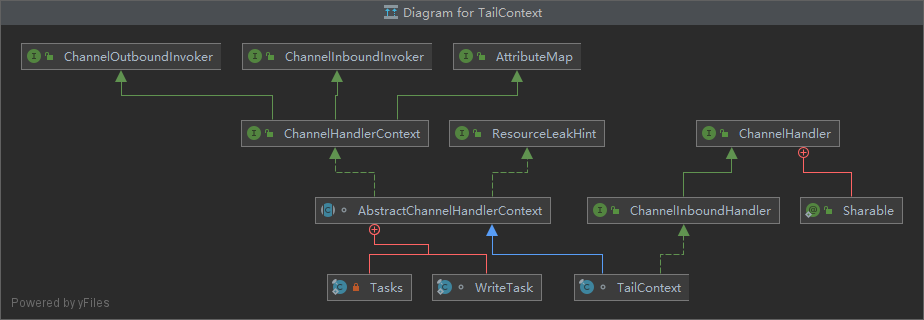
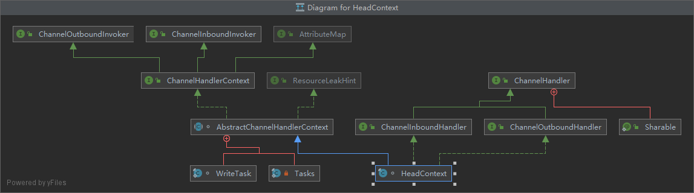
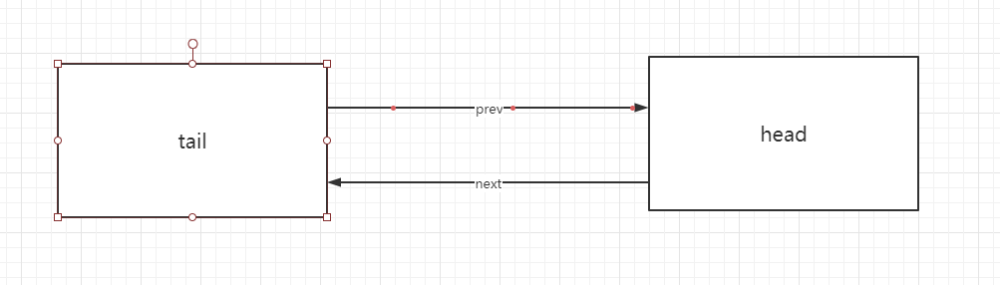
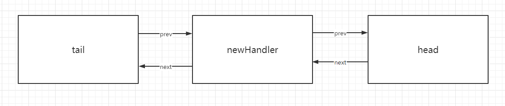

## 走读

因为前面走读代码的时候主要关心的是各个比较大的组件之间的相关联关系的组成的，对Pipeline这块可能就没那么细致的就看了，所以这边打算单独对Pipeline做一个比较细致的走读  
回顾之前的走读过程，其实涉及Pipeline的对象主要是三块代码，具体如下(按执行顺序排序)：
- 初始化NioServerSocketChannel的时候在父类AbstractChannel构造函数中对Pipeline做了初始化
```java
   pipeline = newChannelPipeline();

    protected DefaultChannelPipeline newChannelPipeline() {
        return new DefaultChannelPipeline(this);
    }
```
- 在对NioServerSocketChannel做init的时候调用了Pipeline对象的addLast的方法
```java
    p.addLast(new ChannelInitializer<Channel>() {
        @Override
        public void initChannel(final Channel ch) {
            final ChannelPipeline pipeline = ch.pipeline();
            ChannelHandler handler = config.handler();
            if (handler != null) {
               pipeline.addLast(handler);
            }
            ch.eventLoop().execute(new Runnable() {
                @Override
                public void run() {
                    pipeline.addLast(new ServerBootstrapAcceptor(
                        ch, currentChildGroup, currentChildHandler, currentChildOptions, currentChildAttrs));
                }
            });
        }
    });
```
- 还有就是在Channel注册到NioEventLoop的Selector的时候有做了对应的调用,在AbstracChannel的register0方法中
```java
    //省略···
    pipeline.invokeHandlerAddedIfNeeded();
    //省略···
    pipeline.fireChannelRegistered();
    //省略···
    pipeline.fireChannelActive();
    //省略···
```
分别对这三种涉及的代码块做个简称然后逐个细看了解下，如：创建，初始化，注册激活

### 创建

DefaultChannelPipeline构造函数中涉及的主要代码：
```java
    tail = new TailContext(this);
    head = new HeadContext(this);
    head.next = tail;
    tail.prev = head;
```
单看后面两段next和prev的指向就很容易猜测出这是里面维护了一个双向的链表，但是tail和head的实现类不一样，具体看下这两个类的关系是咋样的


我仔细比对了下发现HeadContext相对于TailContext多实现了ChannelOutboundHandler接口  
此时创建完后Pipeline的对象的链表状态应该是这样的


### 初始化

在初始化的时候会将ChannelHandler添加到pipeline中，看下addLast的实现内容
```java
    public final ChannelPipeline addLast(EventExecutorGroup group, String name, ChannelHandler handler) {
        // group和name都是null
        final AbstractChannelHandlerContext newCtx;
        synchronized (this) {
            checkMultiplicity(handler);
            newCtx = newContext(group, filterName(name, handler), handler);
            addLast0(newCtx);
            if (!registered) {
                newCtx.setAddPending();
                callHandlerCallbackLater(newCtx, true);
                return this;
            }
            EventExecutor executor = newCtx.executor();
            if (!executor.inEventLoop()) {
                callHandlerAddedInEventLoop(newCtx, executor);
                return this;
            }
        }
        callHandlerAdded0(newCtx);
        return this;
    }
```
checkMultiplicity重复判定，在InternalThreadLocalMap池子里面判断是否已经有添加过这个handle，已经存在抛出ChannelPipelineException异常  
前面已经知道了tail和head都是AbstractChannelHandlerContext的对象，所以需要将ChannelHandler转成AbstractChannelHandlerContext，才能添加链表中  
而newContext方法就是转换的作用  
addLast0的方法就是跳转链表的引用  
```java
    private void addLast0(AbstractChannelHandlerContext newCtx) {
        AbstractChannelHandlerContext prev = tail.prev;
        newCtx.prev = prev;
        newCtx.next = tail;
        prev.next = newCtx;
        tail.prev = newCtx;
    }
```
调整完后结果如图:

此时Channel还是出于初始化状态，还未注册到NioEventLoop中，所以会调用newCtx.setAddPending()和callHandlerCallbackLater(newCtx, true)方法  
其中newCtx.setAddPending()通过CAS的方式将新加入的context状态设置为pending  

细看下callHandlerCallbackLater()  
```java
    private void callHandlerCallbackLater(AbstractChannelHandlerContext ctx, boolean added) {
        assert !registered;

        PendingHandlerCallback task = added ? new PendingHandlerAddedTask(ctx) : new PendingHandlerRemovedTask(ctx);
        PendingHandlerCallback pending = pendingHandlerCallbackHead;
        if (pending == null) {
            pendingHandlerCallbackHead = task;
        } else {
            // Find the tail of the linked-list.
            while (pending.next != null) {
                pending = pending.next;
            }
            pending.next = task;
        }
    }
```
added为true，所以task是PendingHandlerAddedTask对象，且pendingHandlerCallbackHead没有初始化过，所以pendingHandlerCallbackHead就是task。  
如果pendingHandlerCallbackHead不是null，则把新增的回调task放到链表的尾部。所以我们明显能知道Pipeline中存在一个pending的回调任务链表。  
其中PendingHandlerAddedTask类是一个Runnable接口的实现，最终是调用Pipeline的callHandlerAdded0(ctx)方法。**暂时对此链表什么时候触发未知，标记下**  


### 注册激活

前面已经看过了Channel这段代码了，所以我们直接调用关键代码处  
```java
     eventLoop.execute(new Runnable() {
        @Override
        public void run() {
            register0(promise);
        }
    });
```
之前这里看的时候漏看了execute里面的实现了，以为是默认的Executor的execute方法，这次走读的时候才发现并不是  
```java
    private void execute(Runnable task, boolean immediate) {
        boolean inEventLoop = inEventLoop();
        addTask(task);
        if (!inEventLoop) {
            startThread();
            if (isShutdown()) {
                boolean reject = false;
                try {
                     if (removeTask(task)) {
                         reject = true;
                     }
                } catch (UnsupportedOperationException e) {
                }
                if (reject) {
                    reject();
                }
            }
        }
        if (!addTaskWakesUp && immediate) {
        wakeup(inEventLoop);
        }
}
```
方法参宿中immediate是否立即执行为true，是否是当前线程是否是NioEventLoop线程为false，然后添加task到taskqueue队列中  
此时inEventLoop=false，所以继续往下走 执行startThread()方法。  
在看这个方法的时候我们回顾下，现在Channel创建了，也初始化了，也在注册的路上了。但是这个被注册的NioEventLoop其实没有线程去一直run着的，因为我们知道Java Nio里ServerSocketChannel
需要一个线程不断的循环调用select方法，那么我们这边其实就是可以猜测startThread方法是否就是新起一个线程在处理这个事情  
```java
    private void startThread() {
        if (state == ST_NOT_STARTED) {
            if (STATE_UPDATER.compareAndSet(this, ST_NOT_STARTED, ST_STARTED)) {
                boolean success = false;
                try {
                    doStartThread();
                    success = true;
                } finally {
                    if (!success) {
                        STATE_UPDATER.compareAndSet(this, ST_STARTED, ST_NOT_STARTED);
                    }
                }
            }
        }
    }
```
新建的线程嘛 状态肯定是ST_NOT_STARTED的，重点看doStartThread()  
```java
private void doStartThread() {
        assert thread == null;
        executor.execute(new Runnable() {
            @Override
            public void run() {
                thread = Thread.currentThread();
                if (interrupted) {
                    thread.interrupt();
                }

                boolean success = false;
                updateLastExecutionTime();
                try {
                    SingleThreadEventExecutor.this.run();
                    success = true;
                } catch (Throwable t) {
                    logger.warn("Unexpected exception from an event executor: ", t);
                }finally{
                    //省略
                }       
            }
        });
    }
```
finnally地方就省略了哈，看了下主要是状态的更替和shutdown的处理等，暂时就不看了。  
executor的初始化就是在NioEventLoopGroup创建的时候做的，且这边调用的实际上是DefaultThreadFactory工厂的newThread方法，且该创建的线程是FastThreadLocalThread类型的  
这里很重要的一点是Thread.currentThread()获取的当前的线程是NioEventLoop这个线程，可以回顾下构造方法里的引用设置  
```java
    this.executor = ThreadExecutorMap.apply(executor, this);
```
我们看下SingleThreadEventExecutor.this.run()的方法实现  
```java
    int selectCnt = 0;
    for (;;) {
        try {
            int strategy;
            try {
                strategy = selectStrategy.calculateStrategy(selectNowSupplier, hasTasks());
```
selectStrategy就是在最早NioEventLoopGroup初始化的时候默认的那个策略模式，这边计算策略只也很简单，hastask方法判断任务队列是否为空  
strategy = hasTask ？ selector.selectNow() : SelectStrategy.SELECT  
前面已经有添加过任务了，所以这边hasTask为true，strategy=selector.selectNow(),此时Channel还没注册呢，所以返回是0，其中strategy的枚举代表
- SelectStrategy.CONTINUE=-2：字面意思continue
- SelectStrategy.BUSY_WAIT=-3：翻译的不太好，还是给原注释吧-Indicates the IO loop to poll for new events without blocking.
- SelectStrategy.SELECT=-1:阻塞到有事件发生

代码往下走，ioRatio初始50，所以不等于100，且strategy=0，所以代码走到这里
```java
    ranTasks = runAllTasks(0);

    protected boolean runAllTasks(long timeoutNanos) {
        fetchFromScheduledTaskQueue();
        Runnable task = pollTask();
        if (task == null) {
            afterRunningAllTasks();
            return false;
        }

        final long deadline = timeoutNanos > 0 ? ScheduledFutureTask.nanoTime() + timeoutNanos : 0;
        long runTasks = 0;
        long lastExecutionTime;
        for (;;) {
            safeExecute(task);
            runTasks ++;
            if ((runTasks & 0x3F) == 0) {
                lastExecutionTime = ScheduledFutureTask.nanoTime();
                if (lastExecutionTime >= deadline) {
                    break;
                }
             }
            task = pollTask();
             if (task == null) {
                lastExecutionTime = ScheduledFutureTask.nanoTime();
                 break;
            }
         }
        afterRunningAllTasks();
        this.lastExecutionTime = lastExecutionTime;
        return true;
    }
```  
fetchFromScheduledTaskQueue方法判断是否scheduledTaskQueue为空，前面没见过所以方法直接返回，这里直接跳过不用看  
从taskQueue中获取到刚才添加的任务  
deadline=0，看起来像是超时时间  
safeExecute里面就是调用task的run方法以及后续的队列任务重复拉取执行，跟之前我们写的Java NIO的demo基本差不多的逻辑  
直接看下afterRunningAllTasks方法，这边是直接所有tailqueue里面的任务，前面我们有提到过，整个NioEventLoop有两个queue，一个是tailQueue一个是
taskQueue，这边对tailQueue里面的元素暂且未知，但是此时为空  

ok，NioEventLoop线程吊起了，之前添加的任务也成功触发了，并且Channel事件在哪被轮询也大概有点影子了，回头继续看下Pipeline后面被调用的地方，也就是
register0(promis)里面的
```java
    //1
    pipeline.invokeHandlerAddedIfNeeded();
    //2
    pipeline.fireChannelRegistered();
    //3
    pipeline.fireChannelActive();
```
####  pipeline.invokeHandlerAddedIfNeeded();

先看 pipeline.invokeHandlerAddedIfNeeded()，此时Channel已经注册到了NioEventLoop中了，且在Pipeline中添加了一个Handler(这个handler是用于绑定Boss和Work的关系)，但是这个handler并没有被执行。  
我们跟着invokeHandlerAddedIfNeeded走下去，最终会看到callHandlerAddedForAllHandlers方法  
```java
    private void callHandlerAddedForAllHandlers() {
        final PendingHandlerCallback pendingHandlerCallbackHead;
        synchronized (this) {
            assert !registered;
            // This Channel itself was registered.
            registered = true;
            pendingHandlerCallbackHead = this.pendingHandlerCallbackHead;
            // Null out so it can be GC'ed.
            this.pendingHandlerCallbackHead = null;
        }

        PendingHandlerCallback task = pendingHandlerCallbackHead;
        while (task != null) {
            task.execute();
            task = task.next;
        }
    }
```
看方法名就知道这里是对添加的所有handler做出调用，并且把Pipeline设置为registered状态，然后获取到头部的PendingHandlerCallback对象，逐步往下调用  
这里我们能发现tail和head其实并没有被调用，看来其实起了一个构建双向链表的作用  
然后这边每个Context对象调用execute方法都是调用本身的callHandlerAdded方法，callHandlerAdded方法中将该Handler状态设置为add complete状态，
然后继续往下调用handlerAdded的方法，因为前面加的Handler是ChannelInitializer类的匿名对象，所以我们具体看这里的实现  
```java
    public void handlerAdded(ChannelHandlerContext ctx) throws Exception {
        if (ctx.channel().isRegistered()) {
            if (initChannel(ctx)) {
                removeState(ctx);
            }
        }
    }
```
很明显这边回调了Handler的init的方法，也就是说所有的Handler的initChannel会在pipeline.invokeHandlerAddedIfNeeded()这里被回调  

#### pipeline.fireChannelRegistered()
通过逐层调用，最后调用的是Pipeline中head的invokeChannelRegistered方法
```java
    public final ChannelPipeline fireChannelRegistered() {
        AbstractChannelHandlerContext.invokeChannelRegistered(head);
        return this;
    }

    static void invokeChannelRegistered(final AbstractChannelHandlerContext next) {
        EventExecutor executor = next.executor();
        if (executor.inEventLoop()) {
            next.invokeChannelRegistered();
        } else {
            executor.execute(new Runnable() {
                @Override
                public void run() {
                    next.invokeChannelRegistered();
                }
            });
        }
    }

    private void invokeChannelRegistered() {
        if (invokeHandler()) {
            try {
                ((ChannelInboundHandler) handler()).channelRegistered(this);
            } catch (Throwable t) {
                notifyHandlerException(t);
            }
        } else {
            fireChannelRegistered();
        }
    }
```
invokeHandler()中判断是否handler是否状态是ADD_COMPLETE，前面我们只知道添加的handler是ADD_COMPLETE状态，但是head和tail都未标记，所以这边我们查看fireChannelRegistered方法  
这个方法本质是从head开始回调所有inbound类型的handler的channelRegistered


#### pipeline.fireChannelActive();

这里isActive判定的时候
```java
    isOpen() && javaChannel().socket().isBound();
```
很明显ServerSocketChannel是open的，但是没有bind，因为这个还处于bind的方法内呢 所以跳过

### 补充
经过上面的分析，明显发现一个问题，就是inbound的handler被回调了channelRegistered方法，但是outbound的并没有，所以我们最初的ServerBootStrap的bind方法走读的
不够细致，有些点漏掉了，我们继续initAndRegister方法结束后往下看  
在doBind方法里面很明显可以看到,doBind0方法
```java
    final ChannelFuture regFuture = initAndRegister();
        final Channel channel = regFuture.channel();
        //省略
        if (regFuture.isDone()) {
            ChannelPromise promise = channel.newPromise();
            doBind0(regFuture, channel, localAddress, promise);
```
```java
    channel.eventLoop().execute(new Runnable() {
            @Override
            public void run() {
                if (regFuture.isSuccess()) {
                    channel.bind(localAddress, promise).addListener(ChannelFutureListener.CLOSE_ON_FAILURE);
                } else {
                    promise.setFailure(regFuture.cause());
                }
            }
        });
```
NioEventLoop的execute机制前面说了，不在赘述，直接看channel.bind的方法
追踪源码看到channel.bind --> pipeline.bind --> tail.bind
```java
    public ChannelFuture bind(final SocketAddress localAddress, final ChannelPromise promise) {
        ObjectUtil.checkNotNull(localAddress, "localAddress");
        if (isNotValidPromise(promise, false)) {
            // cancelled
            return promise;
        }

        final AbstractChannelHandlerContext next = findContextOutbound(MASK_BIND);
        EventExecutor executor = next.executor();
        if (executor.inEventLoop()) {
            next.invokeBind(localAddress, promise);
        } else {
            safeExecute(executor, new Runnable() {
                @Override
                public void run() {
                    next.invokeBind(localAddress, promise);
                }
            }, promise, null, false);
        }
        return promise;
    }
```
熟悉的感觉啊，很明显这边从tail开始逐个回调outbound类型的handler的bind的方法

## 小结

这篇的内容比较多，en···因为内容都是相关联的也就不分成两篇内容了(其实就是比较懒吧)  
简单的总结下这篇的内容：
我们能够知道Pipeline跟Channel是一一对应的，并且内部维护着一个双向链表，所有的handler都放置在里面，
并且里面还维护着一个pending handler的链表，所有加入的handler都是加入到pending的链表中等待着初始化。  
并且inbound和outbound的handler初始化回调方法不一样并且时机也不一样  
并且通过对Pipeline其他方法的链式调用，我们很容易猜测出例如read/write的调用其实是一样的

还有一个重点就是我们知道了NioEventLoop的所有执行Runnable任务都是在调用的时候会判定当前线程是否是NioEventLoop线程，
如果不是全部都是走异步的模式，通过添加Task队列的方式进行处理的。也就是我们之前漏掉的Task队列的用法，还有一个tail的队列，暂时不清楚哪里使用的。

## 友情链接

个人博客，一些个人的分享会首发在这里，希望大家有时间可以逛逛  
[young‘s Blog](https://youngjw.com/)

## 免责申明

本人非系统层面的研发,文章是本人尽可能总结我所知的内容以及参考一些资料所得。  
内容偏向于中间应用层的知识,有任何问题的话请指正我.感谢！  
涉及相关代码请勿用于生产，出了事故概不负责哈~