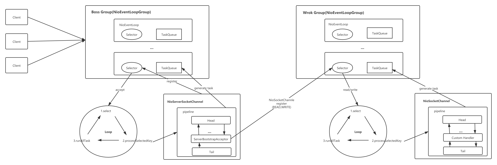

## 前言

本文中红色的删除内容是在根据源码串联编写文档的时候错误理解的表述，绿色的内容是更正的  
但是因为文章内容就是本人一边看源码一边理解的解读，所以个人觉得还想留下这个错误的部分挺好的，就不删除了这部分做修订了
开始之前先看一眼本人按照自己理解画的Netty架构图


## 完整的串联

前面几篇都是回顾NIO的知识点和Netty服务端的启动过程的简析，其实我们在真正使用Netty的时候更关心整个Client链接的过程和数据的走向  
当服务端启动的时候，根据已有知识我们知道在Boss Group的某个NioEventLoop（假设有多个）的Selector上注册了一个ServerSocketChannel，那么链接的开始
肯定是从这个Selector的select方法上监听到ACCEPT事件，从这边入手看整个链接的过程，**后面只提取比较重要的方法说明，其他的都简单的说明后跳过**  

从NioEventLoop的run方法开始，这个方法会一直循环的执行。当strategy代表的是SelectKeys的数量，也就是听见到的事件数，当strategy大于0的时候代表有客户端链接了  

这时候就会执行下面的processSelectedKeys()方法  

selectedKeys是为了区分Selector是否被优化了，前面有提到过，这边直接走原生的processSelectedKeysPlain方法  

**到这里会有几个疑问：**  
- SelectionKey为什么会有attachment
- NioTask是什么 
留着疑问继续往processSelectedKey走参数是AbstractNioChannel的这个 
  
检验SelectionKey是否失效，以及失效了关闭的等不管直接往下，然后从SelectionKey中获取到readyOps
- SelectionKey.OP_CONNECT：这是服务端，跳过
- SelectionKey.OP_WRITE：写事件，不管先跳过
- SelectionKey.OP_READ | SelectionKey.OP_ACCEPT：读和链接事件一起，也就是把链接也当成了读了，ok就这个了
进到unsafe.read()方法里继续往下  

```diff
- ~~这里的unsafe前面提到过的是NioSocketChannelUnsafe对象，NioSocketChannelUnsafe继承NioByteUnsafe，所以看NioByteUnsafe的read实现~~
```

里面的读取的具体实现暂时不关心，我们直接看到了pipeline.fireChannelRead(byteBuf)的调用，很明显这里打算链式调用handler的channelRead的方法了  
而我们明确的记得处理链接的Channel除了自定的Handler，源码默认添加了的Handle(ServerBootstrapAcceptor)，如下：
```java
    p.addLast(new ChannelInitializer<Channel>() {
        @Override
        public void initChannel(final Channel ch) {
            final ChannelPipeline pipeline = ch.pipeline();
            ChannelHandler handler = config.handler();
            if (handler != null) {
                pipeline.addLast(handler);
            }
            ch.eventLoop().execute(new Runnable() {
                @Override
                public void run() {
                    pipeline.addLast(new ServerBootstrapAcceptor(
                        ch, currentChildGroup, currentChildHandler, currentChildOptions, currentChildAttrs));
                }
            });
        }
    });
```
这里的几个参数有必要在明确的说下：
- ch：处理链接的NioServerSocketChannel对象
- currentChildGroup：EventLoopGroup对象，也就是Work Group
- currentChildHandler：自定申明的handler
- 省略···
继续往下看ServerBootstrapAcceptor的channelRead方法  
  
看到channelRead方法的时候其实有点没明白
```java
    public void channelRead(ChannelHandlerContext ctx, Object msg) {
        final Channel child = (Channel) msg;

        child.pipeline().addLast(childHandler);

        setChannelOptions(child, childOptions, logger);
        setAttributes(child, childAttrs);

        try {
            childGroup.register(child).addListener(new ChannelFutureListener() {
                @Override
                public void operationComplete(ChannelFuture future) throws Exception {
                    if (!future.isSuccess()) {
                        forceClose(child, future.cause());
                    }
                }
            });
        } catch (Throwable t) {
            forceClose(child, t);
        }
    }
```
**msg为什么会是Channel呢，我看完Channel接口的实现类，猜测可能是NioSocketChannle对象**，但是还是有点没明白这个转换是怎么实现的。后面的逻辑其实就比较明确了，
把这个Channel对象注册到Workd Group的某个NioEventLoop的Selector上，这个其实已经分析过了。回过头看下这个msg是怎么转换的  

<font color=#008000>特么重头开始捋了几遍，发现自己代入了一个误区，就是processSelectedKey方法中的unsafe默认代入到了NioSocketChannelUnsafe对象，然后默认使用了NioByteUnsafe实现，其实另一种的NioMessageUnsafe读出来就是
NioSocketChannle对象</font>    
这样逻辑就能走的通，所以需要先解决前面的疑问SelectionKey为什么会有attachment  

google了下Java NIO Selector attachment关键，发现attachment的用法除了在SelectionKey上绑定attachment，后面再取出来用这种方式之外，还可以在Channel绑定到Selector的时候就进行绑定
attachmnt，这样得到的SelectionKey就有attachment的值拉，恍然大悟哦，说到底还是对JDK API不熟悉撒。翻出register的那段代码查看下
```java
    selectionKey = javaChannel().register(eventLoop().unwrappedSelector(), 0, this);
```
this指的是NioServerSocketChannel对象，而NioServerSocketChannel是AbstractNioMessageChannel的子类。所以unsafe是NioMessageUnsafe类的对象

还有一个疑问未解决：NioTask是什么  
首先我们可以肯定SelectionKey里面的attachment肯定不是NioTask的对象  
全局查了下，NioEventLoop里面也有一个register方法，参数就是使用的NioTask，看下方法的注释
```java
    Registers an arbitrary SelectableChannel, not necessarily created by Netty, to the Selector of this event loop.
    Once the specified SelectableChannel is registered, the specified task will be executed by this event loop when the SelectableChannel is ready.
```

## 友情链接

个人博客，一些个人的分享会首发在这里，希望大家有时间可以逛逛  
[young‘s Blog](https://youngjw.com/)

## 免责申明

本人非系统层面的研发,文章是本人尽可能总结我所知的内容以及参考一些资料所得。  
内容偏向于中间应用层的知识,有任何问题的话请指正我.感谢！  
涉及相关代码请勿用于生产，出了事故概不负责哈~
