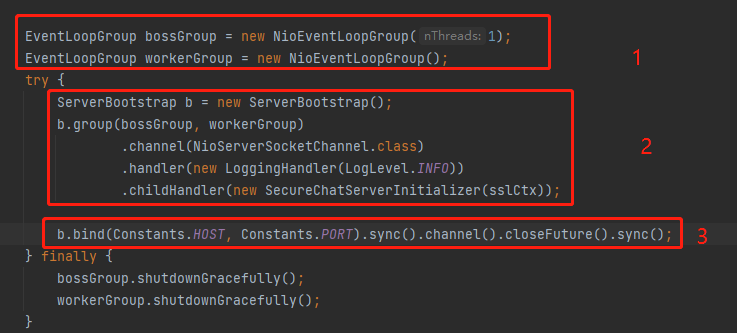

### 走读Netty的初衷

作为Java研发，大家应该肯定都接触了解或者直接使用过Netty框架。本人是在16的时候接触Netty的，那时候想做个模拟SpringBoot设计思路高并发的服务端。  
当时了解Netty如何使用的时候就哼哧哼哧的写了一个demo。  
后面转做了大数据接触到了如Hadoop、Flume、Storm等这类Java开源服务，以及后续分布式事务Tx-manager的时候。那时候因为一些原因会需要去扒源码，才发现原来底层使用的通信框架其实都是Netty。  
这么多年过去了，作为一名Java研发我觉得自己很有必要深入源码层面了解下Netty

### 走读思路

在开始走读之前我其实觉得回顾一些相关知识是很有必要的，这样有利于我们去理解作者的思路以及方便我们去做一些猜测。  
我个人是觉得走读源码其实没有必要很细致的去扣每个方法的，大概知道整体的逻辑和思路即可。如果遇到一些bug或者排查一些问题的时候再具体扣细节比较好。  
因为Netty本质是对Java NIO的更高级的封装，那么我们就有必要回顾一些相关的NIO的知识了  
**[相关的测试代码样例请勿用于生产](src/main/java/com/sourcecode/learning/young)**

- [回顾系统IO模型](1.回顾系统IO模型.md)
- [回顾JavaIo类型](2.回顾JavaIO类型.md)
- [Java NIO的理解](3.Java_NIO理解.md)

在使用一个开源服务的时候，本人一般的思路都是先看下官网的简介以及相关组件的介绍，然后根据官方的example进行学习以及改编使用  
我们在看Netty的example的时候很容易总结Netty的使用大致如下图（这边专指Server端的使用，后续的分析也只基于Server）：  

我们基于已有的NIO知识点去分别走读下这三步的源码

- [EventLoopGroup初始化过程](4.EventLoopGroup初始化过程.md)
- [ServerBootstrap初始化过程](5.ServerBootstrap初始化过程.md)
- [ServerBootstrap的bind](6.ServerBootstrap的bind.md)

### 零碎知识点

Netty框架其实还有一些很优秀的特性以及优化。如：零拷贝，内存池的优化，无锁化串行等。后面有时间也会细致的了解完后做个总结和分享
- FastThreadLocalThread(Todo)
- PlatformDependent.<Runnable>newMpscQueue()(Todo)
- Selector的优化(Todo)

### Netty 版本

忘了交代下这边走读的Netty版本是**4.1.48.Final**